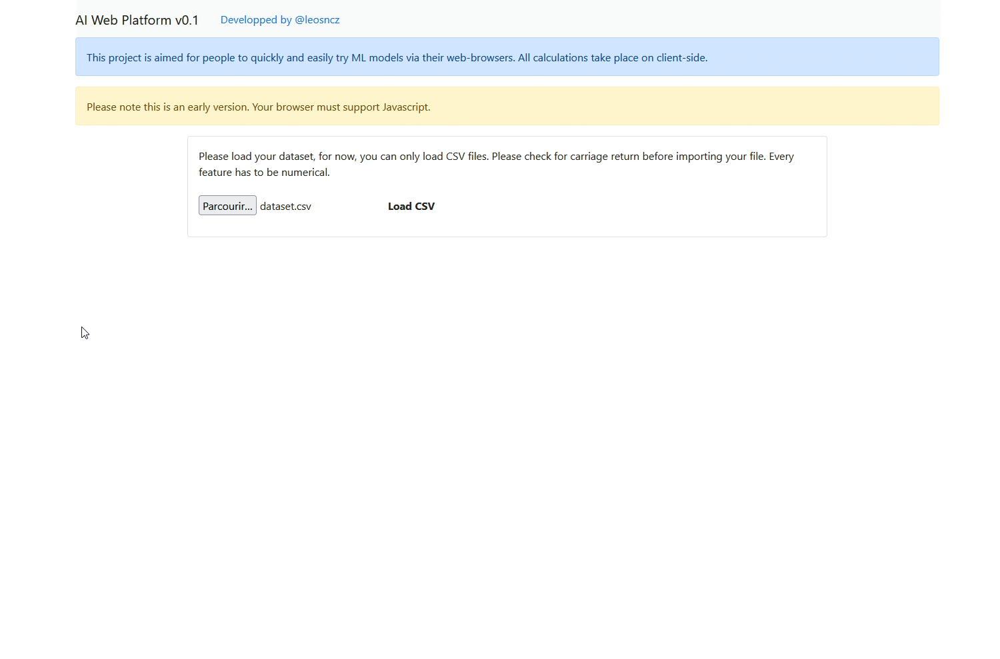

# AIWebPlatform
Online platform to quickly and easily try ML models via a web-browser. Quick demo using classic single layer perceptron :

Everything is done through your browser via Javascript ! No need to install any additional software except a modern browser. Currently support :
- Single Layer perceptron
Working on :
- Linear regression
- Multilayer perceptron
- Other import methods, CSV is too restrictive.
- Alternative to BGD, like SGD and MBGD.
